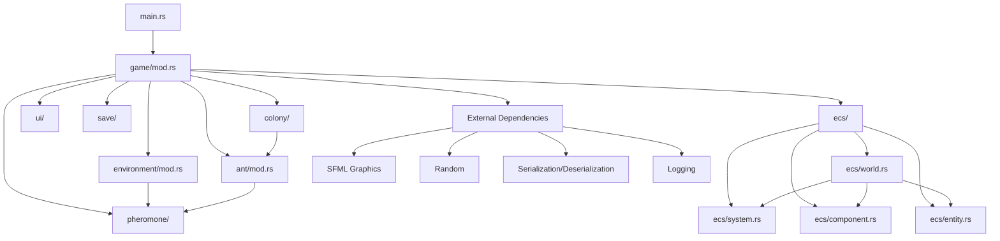

# Ant Simulacrum Architecture Overview

This document provides a high-level overview of the Ant Simulacrum architecture.

## Architecture Diagram

## Module Descriptions

- **main.rs**: Program entry point, initializes the game and logging
- **game/**: Core game loop and state management
- **ecs/**: Entity Component System implementation
  - **world.rs**: Manages entities, components and systems
  - **entity.rs**: Entity representation
  - **component.rs**: Component types and storage
  - **system.rs**: Game logic systems
- **ant/**: Ant entities, behaviors and states
- **colony/**: Colony management and properties
- **environment/**: World environment elements like food and obstacles
- **pheromone/**: Pheromone system for ant communication
- **ui/**: User interface elements
- **save/**: Save/load game state functionality

## Data Flow

1. The game loop runs in the Game module
2. The ECS World manages entities (ants, food, etc.) and their components
3. Systems process entities with specific components each frame
4. Ants interact with the environment and deposit pheromones
5. The UI renders the current state and handles user input
6. Save system serializes/deserializes game state when requested 